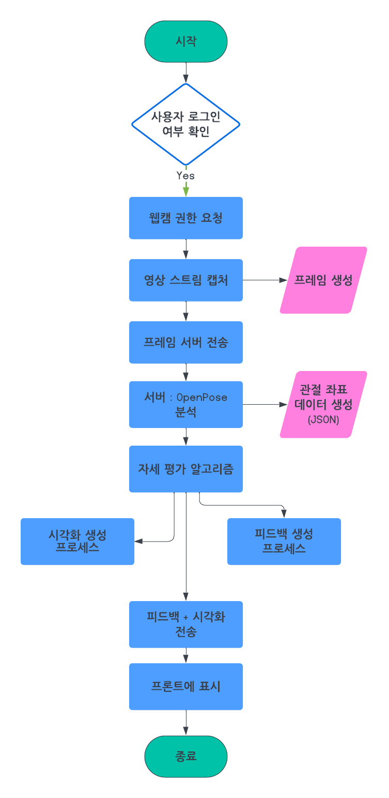

# 자세 분석 웹 서비스 워크플로우

## 1. 시스템 개요
- 사용자는 웹 브라우저에서 웹캠을 통해 실시간으로 자신의 자세를 촬영
- 촬영된 영상 스트림을 서버로 전송
- 서버는 OpenPose 기반 자세 분석을 수행
- 분석 결과(자세 정보 및 피드백)를 실시간으로 사용자에게 반환

---

## 2. 전체 워크플로우

### 1) 사용자 측 (프론트엔드)
1. 웹사이트 접속 및 로그인/회원가입
2. 웹캠 접근 권한 요청 및 허용
3. 웹캠 영상 스트림을 실시간으로 캡처
4. 일정 프레임 단위로 서버에 영상 데이터 전송 (WebRTC, WebSocket, 또는 HTTP)
5. 서버로부터 분석 결과(자세 피드백) 수신
6. 화면에 실시간 피드백 및 자세 교정 가이드 표시

### 2) 서버 측 (백엔드)
1. 영상 데이터 수신 (스트림 또는 이미지 프레임)
2. OpenPose를 이용해 자세 추정 수행
3. 추정된 관절 좌표 기반으로 자세 평가 및 피드백 생성
4. 피드백 및 시각화 데이터(예: 관절 라인 오버레이) 생성
5. 결과를 사용자에게 실시간 전송

### 3) 데이터 흐름
- [사용자 웹캠] → [프론트엔드] → [서버] → [OpenPose 분석] → [피드백 생성] → [프론트엔드] → [사용자]

---

## 3. 기술 스택 예시

- **프론트엔드:** React.js, WebRTC/WebSocket, HTML5 Video
- **백엔드:** Python (Flask/FastAPI), OpenPose, WebSocket/REST API
- **서버 환경:** GPU 지원 서버, Docker, Linux
- **기타:** HTTPS, JWT 인증, 로그/모니터링

---

## 4. 상세 단계

### 1. 사용자 인증 및 웹캠 연결
- 회원가입/로그인 → 웹캠 권한 요청 → 영상 미리보기

### 2. 영상 데이터 전송
- 일정 간격(예: 1초 10프레임)으로 프레임 캡처
- WebSocket 등으로 서버에 전송

### 3. 서버에서 자세 분석
- 프레임 수신 → OpenPose로 관절 추출 → 자세 평가 알고리즘 적용

### 4. 피드백 생성 및 전송
- 잘못된 자세 감지 시 교정 메시지 생성
- 관절 위치 시각화(오버레이 이미지 등) 생성
- 실시간으로 프론트엔드에 전송

### 5. 사용자 피드백 표시
- 실시간 피드백 메시지 및 시각화 결과 표시
- 자세 교정 가이드 제공

---

## 5. 확장 아이디어

- 자세 교정 이력 저장 및 리포트 제공
- 다양한 운동/자세별 분석 지원
- 모바일 웹 지원

---

## 6. 워크플로우 다이어그램

